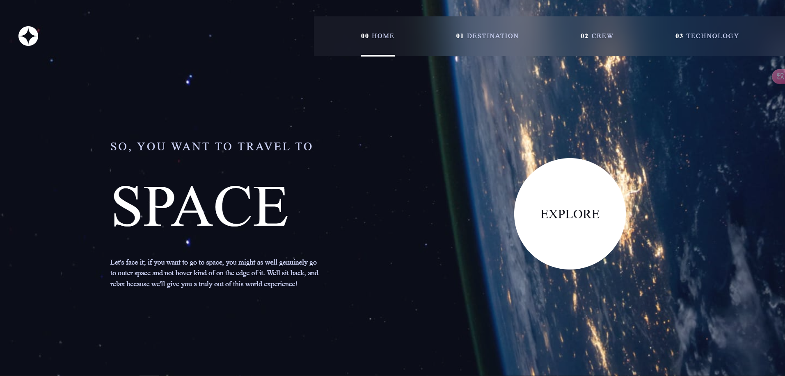

# SpaceTourism

## Built with
[![React][React.js]][React-url]
[![TS]][TS-url]
[![TailwindCss]][TailwindCss-url]

## Links
- Solution URL: https://github.com/mk04-dev/SpaceTourism
- Live URL: https://space-tourism-ten-iota.vercel.app

[React.js]: https://img.shields.io/badge/React-20232A?style=for-the-badge&logo=react&logoColor=61DAFB
[React-url]: https://reactjs.org/
[TS]: https://img.shields.io/badge/typescript-20232A?style=for-the-badge&logo=typescript&logoColor=3178C6
[TS-url]: https://www.typescriptlang.org/
[Mobx]: https://img.shields.io/badge/mobx-20232A?style=for-the-badge&logo=mobx&logoColor=FF9955
[Mobx-url]: https://mobx.js.org/
[TailwindCSS]: https://img.shields.io/badge/tailwindcss-20232A?style=for-the-badge&logo=tailwindcss&logoColor=#06B6D4
[TailwindCSS-url]: https://tailwindcss.com/

[FEMentor]: https://img.shields.io/badge/frontend_mentor-challenge-20232A?style=for-the-badge&logo=frontendmentor&logoColor=#3F54A3
[FEMentor-url]: https://www.frontendmentor.io/challenges/multistep-form-YVAnSdqQBJ/hub